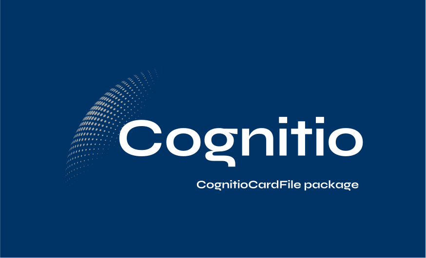

# CognitioCardFile (CCF) File Format Specification

## Overview

CognitioCardFile (CCF) is a file format designed with robust security measures to ensure the integrity and safety of data exchange. It is the first type-safe file format, guaranteeing that data types remain consistent and preventing conversions that could compromise data integrity. This document outlines the key features and specifications of the CCF format.

## Features

### Type Safety
CCF is inherently type-safe, meaning data remains in its original format throughout processing. For example, a boolean value will not be converted to a string unintentionally, preserving data integrity.

### Non-Overwritable
Files in the CCF format are non-overwritable. This prevents accidental or malicious overwriting of data, ensuring that original content remains intact.

### Protection Against SQL Injection
String data within CCF files is protected against SQL injection attacks. Measures are in place to prevent malicious alterations to string data that could exploit vulnerabilities in database systems.

### Metadata Fingerprinting
Each CCF file contains a special set of metadata called "fingerprint," which consists of unique cryptographic identifiers. This fingerprint serves as a signature, enabling recipients to verify the authenticity and integrity of the file. Files with invalid or tampered fingerprints will be flagged and prevented from being processed further, thus safeguarding against hacking attempts.

### Pre-Read Verification of Critical Information
Before a CCF file is read, critical information about its contents is shared with the recipient. If there is any discrepancy between the shared information and the actual file content, the file will be rejected without being read. This preemptive verification mechanism helps identify and mitigate the risk of viruses or other malicious entities attempting to execute within the system.

## Conclusion

CognitioCardFile (CCF) sets a new standard for secure data exchange, combining type safety, non-overwritability, protection against SQL injection, metadata fingerprinting, and pre-read verification to ensure the integrity and safety of data transmission. By implementing these robust security measures, CCF enhances trust and confidence in file exchange processes across various applications and industries.

*For more information and inquiries, please contact us at contact@kuaralabs.org or visit our website at [www.kuaralabs.org](https://www.kuaralabs.org).*
